# Самбуров Георгий

# Лабораторная работа 1
## 1


## 2


## 3


## 4


## 5


## 6


## 7


# Лабораторная работа 2
## 1

### min_max
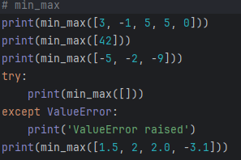
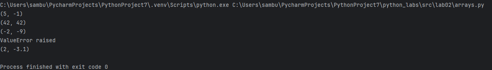
```python
def min_max(nums):
    maxx, minn = -2**63, 2**63
    if len(nums) == 0:
        raise ValueError
    for x in nums:
        if x > maxx:
            maxx = x
        if x < minn:
            minn = x
    return maxx, minn
```

### unique_sorted
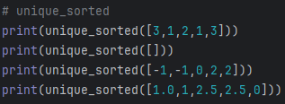
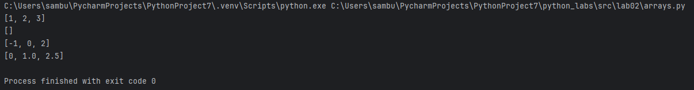
```python
def unique_sorted(nums):
    nums = list(set(nums))
    changed = True
    while changed:
        changed = False
        for i in range(len(nums) - 1):
            if nums[i] > nums[i + 1]:
                changed = True
                nums[i], nums[i + 1] = nums[i + 1], nums[i]
    return nums
```

### flatten
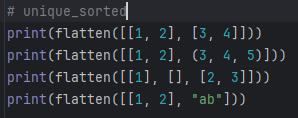
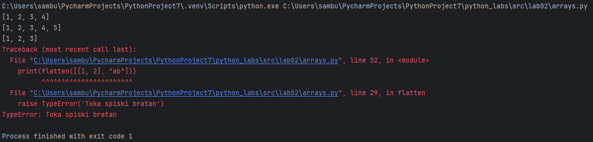
```python
def flatten(mat):
    res = []
    for i in mat:
        if isinstance(i, (list, tuple)):
            res = res + list(i)
        else:
            raise TypeError('Toka spiski bratan')
    return res

```

## 2
### transpose
```python
def transpose(mat):
    if any([len(mat[i]) != len(mat[i + 1]) for i in range(len(mat) - 1)]):
        raise ValueError('Ne matriza')
    res = []
    if len(mat) > 0:
        for i in range(len(mat[0])):
            res.append([mat[j][i] for j in range(len(mat))])
    return res

print(transpose([[1, 2, 3]]))
print(transpose([[1], [2], [3]]))
print(transpose([[1, 2], [3, 4]]))
print(transpose([]))
print(transpose([[1, 2], [3]]))
```
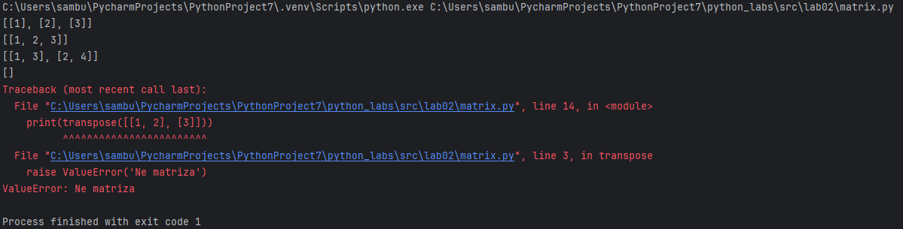

### row_sums
```python
def row_sums(mat):
    if any([len(mat[i]) != len(mat[i + 1]) for i in range(len(mat) - 1)]):
        raise ValueError('Ne matriza')
    return [sum(i) for i in mat]

print(row_sums([[1, 2, 3], [4, 5, 6]]))
print(row_sums([[-1, 1], [10, -10]]))
print(row_sums([[0, 0], [0, 0]]))
print(row_sums([[1, 2], [3]]))
```
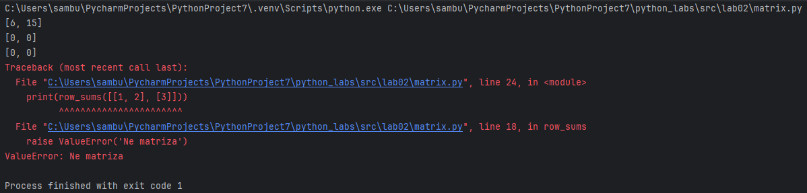

### col_sums
```python
def col_sums(mat):
    if any([len(mat[i]) != len(mat[i + 1]) for i in range(len(mat) - 1)]):
        raise ValueError('Ne matriza')
    return [sum([mat[j][i] for j in range(len(mat))]) for i in range(len(mat[0]))]

print(col_sums([[1, 2, 3], [4, 5, 6]]))
print(col_sums([[-1, 1], [10, -10]]))
print(col_sums([[0, 0], [0, 0]]))
print(col_sums([[1, 2], [3]]))
```
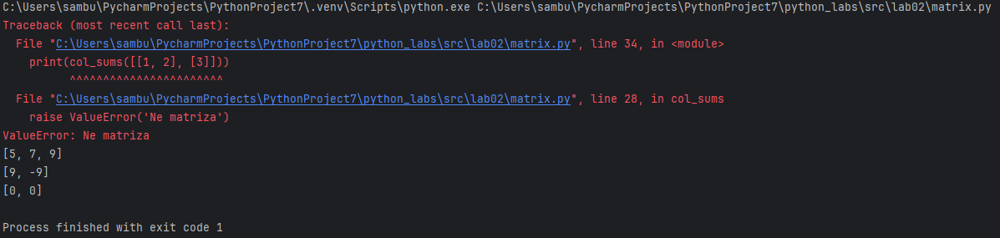

## 3

```python
def check_validity(rec):
    if not isinstance(rec, tuple):
        raise TypeError('Not a tuple')
    if not isinstance(rec[0], str) or not isinstance(rec[1], str):
        raise TypeError('Not a string')
    if not isinstance(rec[2], float):
        raise TypeError('Not a float')
    if len(rec[0]) == 0 or len(rec[1]) == 0:
        raise ValueError('Empty name/group')
    if rec[2] < 0:
        raise ValueError('Negative GPA value')

def initials(name):
    name = name.strip().split()
    if not 2 <= len(name) <= 3:
        raise ValueError('Not a valid name')
    extra = ''
    if len(name) == 3:
        extra = name[2][0].upper() + '.'
    return f'{name[0].capitalize()} {name[1][0].upper()}.' + extra

def format_record(rec):
    check_validity(rec)
    return f'{initials(rec[0])}, гр. {rec[1]}, GPA: {round(rec[2], 2):.2f}'


print(format_record(("Иванов Иван Иванович", "BIVT-25", 4.6)))
print(format_record(("Петров Пётр", "IKBO-12", 5.0)))
print(format_record(("Петров Пётр Петрович", "IKBO-12", 5.0)))
print(format_record(("  сидорова  анна   сергеевна ", "ABB-01", 3.999)))
```
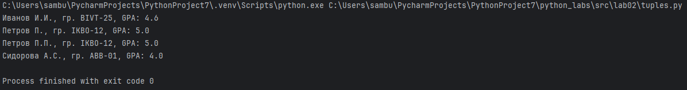

# Лабораторная Работа №3
## бибутека
### normalize

```python
def normalize(text: str, casefold: bool = True, yo2e:bool = True) -> str:
    if casefold: text = text.casefold()
    if yo2e: text = text.replace('ё', 'е').replace('Ё', 'Е')
    text = text.replace('\n', ' ')
    text = text.replace('\r', ' ')
    text = text.replace('\t', ' ')
    return ' '.join([i for i in text.strip().split() if i != ''])

print(normalize("ПрИвЕт\nМИр\t"))
print(normalize("ёжик, Ёлка"))
print(normalize("Hello\r\nWorld"))
print(normalize("  двойные   пробелы  "))
```
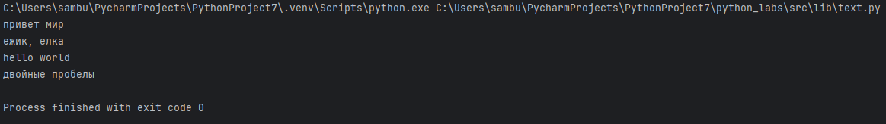

### tokenize

```python
import string


def tokenize(text: str) -> list[str]:
    res = []
    cur = ''
    russian = 'АБВГДЕЁЖЗИЙКЛМНОПРСТУФХЦЧШЩЪЫЬЭЮЯ'
    incl = russian + russian.lower() + string.ascii_letters + string.digits + '_-'
    for i in text:
        if i in incl:
            cur += i
        elif cur != '':
            res.append(cur)
            cur = ''
    return res + ([cur] if cur != '' else [])
```
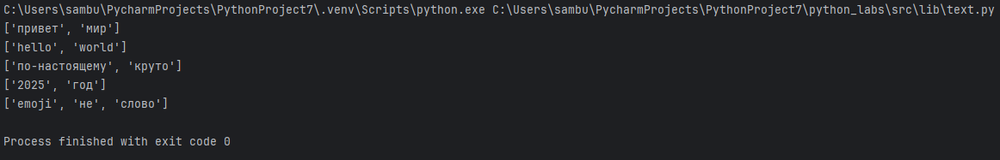

### count_freq + top_n

```python
def count_freq(tokens: list[str]) -> dict[str, int]:
    res = dict.fromkeys(tokens, 0)
    for token in tokens:
        res[token] += 1
    return res

def top_n(freq: dict[str, int], n: int = 5) -> list[tuple[str, int]]:
    return sorted([(i, freq[i]) for i in freq.keys()], key=lambda x: (2**63-x[1], x[0]))[:n]

a = ["a","b","a","c","b","a"]
print(a := count_freq(a))
print(top_n(a, n=2))
print()
a = ["bb","aa","bb","aa","cc"]
print(a := count_freq(a))
print(top_n(a, n=2))
```
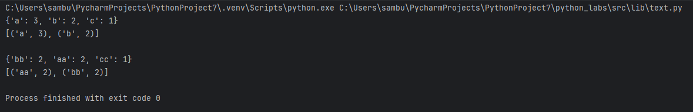

## Задание 2

